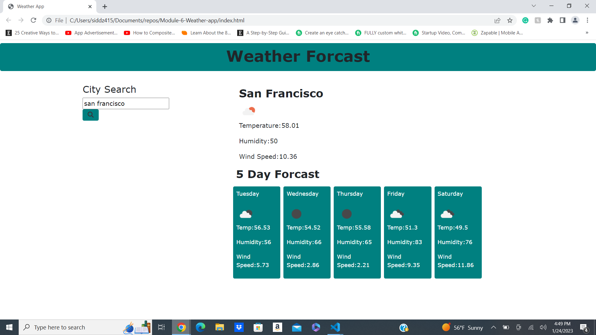

# Weather-app
# Description
Weather app is an application to find weather condition of a given city for current and 5 day forecast. The Weather app uses third party Api to get current and future conditions for the city you searched for. The weather section includes:
City, Day, Icon-image
Temperature
Humidity
Wind Speed

## Github Repo Link
https://github.com/siddz415/Weather-app

## Github Pages Link
https://siddz415.github.io/Weather-app/

## Screenshot
 